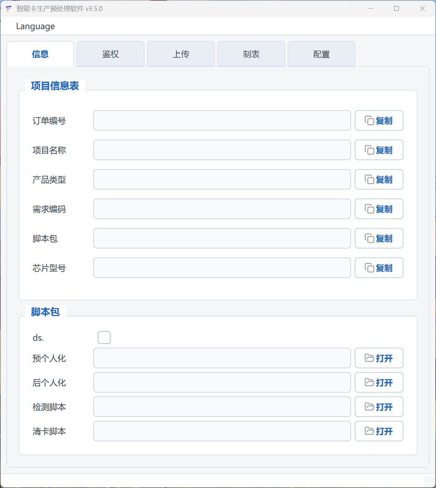
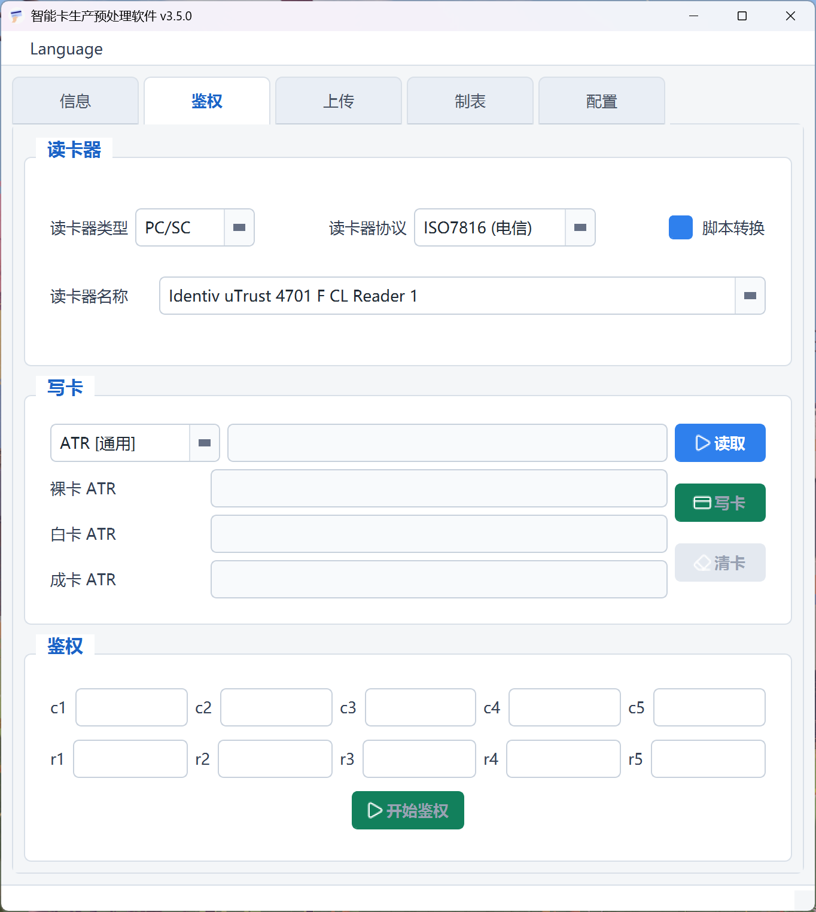
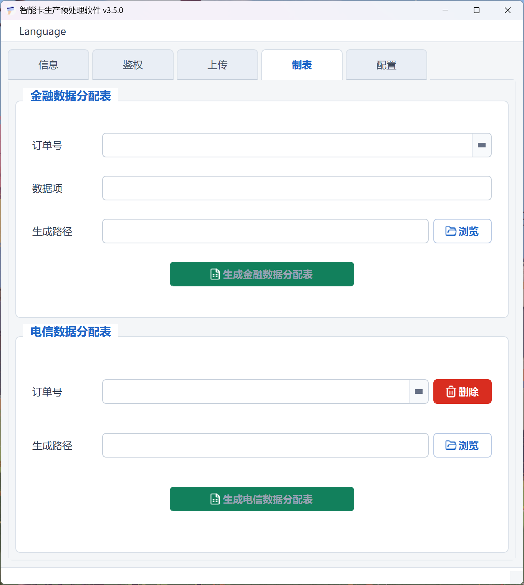
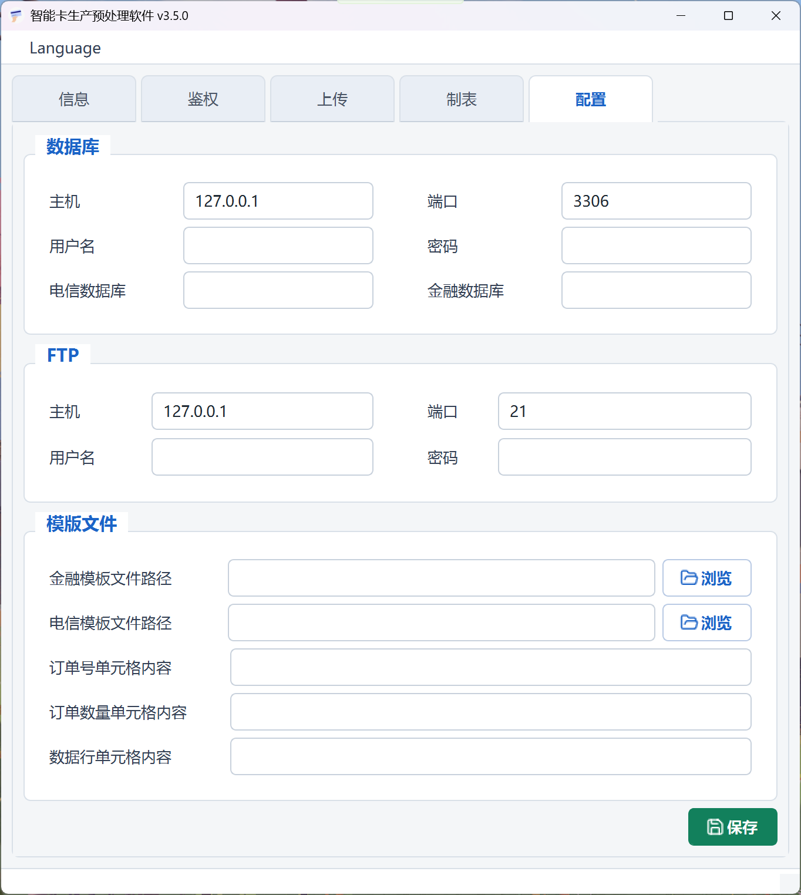

# DataHandler

智能卡生产预处理软件，用于处理生产数据包、执行写卡和鉴权流程，并辅助生成电信/金融数据分配表。

## 界面预览









## 主要功能

- 解析生产数据包，提取订单信息、研发脚本包和个人化数据。
- 调用读卡器执行复位、读脚本、写卡、AKA 鉴权和清卡。
- 根据数据库订单数据生成电信或金融数据分配表。
- 在数据上传异常时删除已处理的电信订单数据。
- 支持中文和英文界面切换。

## 使用流程

### 1. 准备数据包

数据包必须包含研发脚本包和个人化数据。如果需要解析项目信息表中的订单编号、项目名称、产品类型、需求编码、脚本包和芯片型号等信息，请将项目信息表一并放入数据包。

数据包可以是文件夹，也可以是压缩包。

### 2. 解析订单

将数据包拖入软件主窗口。软件处理完成后会弹出订单处理完成提示，并在信息页面展示解析到的订单信息和脚本包信息。

解析成功后，复制、打开、写卡、鉴权和清卡等相关按钮会变为可用。

### 3. 写卡

切换到鉴权页面，按实际设备选择读卡器类型、读卡器协议和读卡器名称。

写卡前建议先点击读取按钮复位卡片，确认当前卡片状态。确认无误后点击写卡按钮，等待写卡窗口提示完成。

### 4. 鉴权

写卡完成后关闭写卡窗口，点击开始鉴权按钮。鉴权成功后软件会弹出成功提示。

### 5. 清卡

鉴权完成后请及时点击清卡按钮，清理卡片状态，方便下一次生产或测试操作。

## 制表

制表页面用于自动生成电信和金融数据分配表，可在 DMS 制表较慢时作为替代工具。

### 1. 配置数据库和模板

切换到配置页面，填写数据库、FTP 和模板文件配置：

- 数据库：主机、端口、用户名、密码、电信数据库、金融数据库。
- FTP：主机、端口、用户名、密码。
- 模板文件：金融模板文件路径、电信模板文件路径、订单号单元格内容、订单数量单元格内容、数据行单元格内容。

配置完成后点击保存。

### 2. 选择订单

切换到制表页面，在金融或电信区域选择订单号。

### 3. 选择生成路径

点击浏览按钮，选择数据分配表的输出路径。

### 4. 生成数据分配表

确认订单号、模板文件和输出路径无误后，点击生成按钮。生成成功后软件会弹出提示。

## 删除订单

删除订单功能用于数据中心上传过程中出现异常时，删除已处理订单并重新上传。

该功能会彻底删除订单相关数据，包括生产数据。使用时请确认订单号无误，并输入删除密码后再执行删除。

## 配置文件

软件启动时会读取当前运行目录下的 `config.ini`。如果文件不存在，软件会创建默认配置。

常用配置包括：

- `mysql`：数据库连接信息。
- `ftp`：FTP 连接信息。
- `path`：远程个人化数据和临时文件路径。
- `template`：制表模板路径和单元格配置。
- `qsc_card_reader` / `scsc_card_reader`：读卡器连接配置。

## 构建

项目使用 CMake 构建，主要依赖 Qt 5、fmt、xlnt、libcurl 和 card_device。

当前项目配置会在存在 `CGEAR_HOME` 环境变量时使用 `$CGEAR_HOME/scripts/buildsystems/vcpkg.cmake` 作为 vcpkg 工具链，并根据目标位数选择 `x86-windows` 或 `x64-windows` triplet。

```powershell
cmake -S . -B build -G Ninja -DCMAKE_BUILD_TYPE=Release
cmake --build build --config Release
```

构建产物输出到 `bin/DataHandler.exe`。

## 运行依赖

运行时需要随程序一起部署 Qt 运行库以及项目依赖的动态库。`cgear.json` 中记录了当前运行依赖清单，包括：

- `fmt`
- `xlnt`
- `libcurl`
- `zel_core`
- `zel_myorm`
- `zel_crypto`
- `card_reader`
- `card_script`
- `card_device`
- `libcrypto-3`
- `libssl-3`
- `libmysql`
- `qSmartReader`
- `SmartCom`
- `zlib1`
- `libmupdf`

## 目录说明

- `src/`：应用源码。
- `res/ui/`：Qt Designer UI 文件。
- `res/qss/`：界面样式。
- `res/image/`：程序图标、状态图片和 README 截图。
- `res/rc/`：Qt 资源文件和 Windows 资源文件。
- `res/translation/`：中英文翻译文件。
- `test/`：测试代码。
